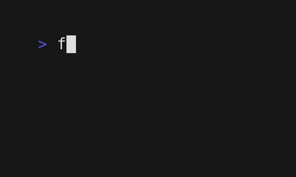

## faker200 is a CLI tool that genrates fake files.

### Demo:

### Goal:

This tool is meant to practice solving programming problems using the Go language.

### Setup (using `go install`):

`go install github.com/mdysrx/faker200@latest`

### Examples:

`faker -f 1` should generate a fake empty .txt file inside `faker200` directory

`faker -f 3 -d 10` should create 10 directories, including 3 empty .txt files each

`faker -h` show help

> Note #1: all generated files  & directories are created within a `faker200` directory

> Note #2: the app create maximum of 200 directories, with maximum 200 files per each 

Idea and execution by Muhammad Yasser @ the 2024.

Twitter/Github: @mdysrx
